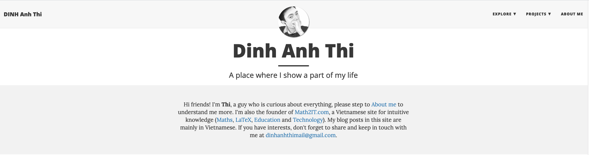
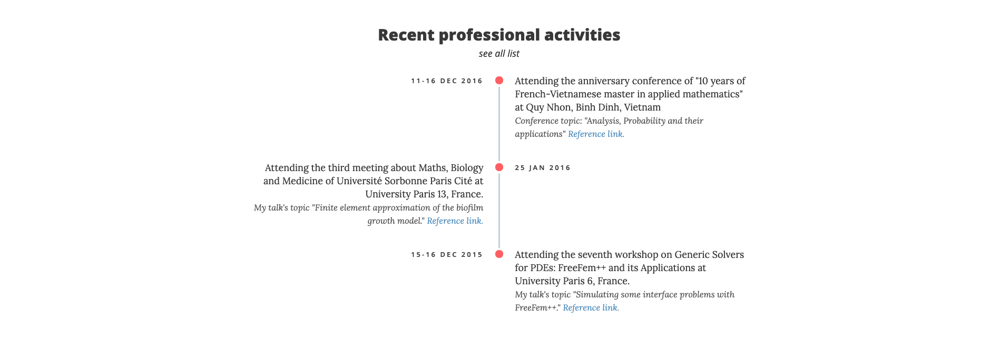
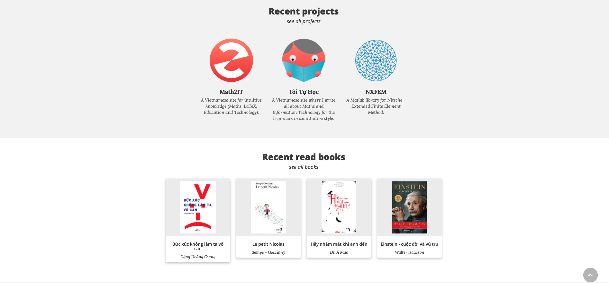
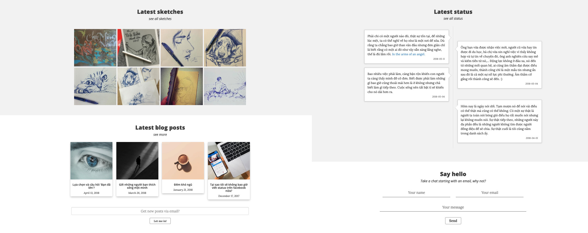
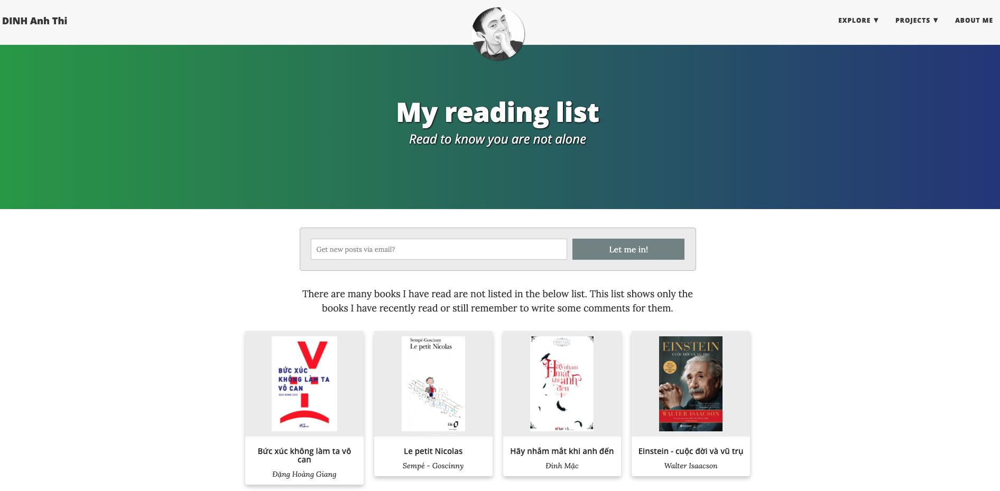

# v0.dinhanhthi.com 

Source code of my personal website (using Jekyll). If you would like to use this source code, please indicate me in the credit and let me know first, thanks! My email: dinhanhthi@gmail.com.

⭐ **Demo**: https://v0.dinhanhthi.com/

## Build and deploy

__Note__: On Windows, you should [use WSL2](https://dinhanhthi.com/docker-wsl2-windows) to run Jekyll site.

After cloning to a local server, run these:

~~~
# install git

# install ruby
ruby --version

# install bundler
gem install bundler

# cd to the repo directory and install gems
bundle install

# run the server (http://localhost:4000)
bundle exec jekyll serve

# incremental build (only build the changes, faster)
bundle exec jekyll serve -I
~~~