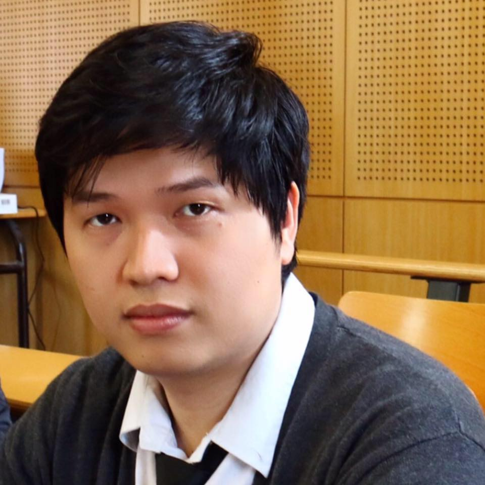

  

    <h1>{{ site.author.name }}</h1>
    

  My research mainly concentrates  on the analysis of   Partial Differential Equations (PDEs). I received in 2019  my  Ph.D  from Sorbonne Paris Nord University,  under the supervision of  Hatem ZAAG.  The thesis  purely contributed on  the construction of   finite time singularity formations to PDEs which are non symmetric or non variational. In particular, I am focusing on the two phenomena:   finite time  blowup and touch down. Now, I am a postdoctoral associate at New York University in Abu Dhabi, under the supervision of  Tej-Eddine GHOUL. The study focus   on the  Type II blowup   and  construction  smooth    solutions  to  SQG equation which may develop  singularity in finite time.     Such  phenomenon  remains open until now.
    

  

  

    
  

## <i class="fas fa-university"></i> Research


  



  - <strong>{{ item.author }}</strong>. "{{ item.article }}". *{{ item.editor }}*. {{ item.more }}. <a href="files/pdf/{{ item.pdf }}" target="_blank">pdf</a>.  


  - [_See more_...](/research)


## <i class="fas fa-chalkboard-teacher"></i> Teaching


  



  - <strong>{{ item.course }}</strong>. _{{ item.place }}_. {{ item.time }}. {{ item.more }}. <a href="files/pdf/{{ item.pdf }}" target="_blank">pdf</a>.  


  - [_See more_...](/research)


## <i class="fas fa-mail-bulk"></i> Contact

- **Website**: [vophuongthuy.github.io](https://vophuongthuy.github.io)

- **Office**: Office 1100A,  Bulding A2,  Department of mathematics, NYU in Abu Dhabi
- **Email**: [{{site.author.email}}](mailto:{{site.author.email}})
